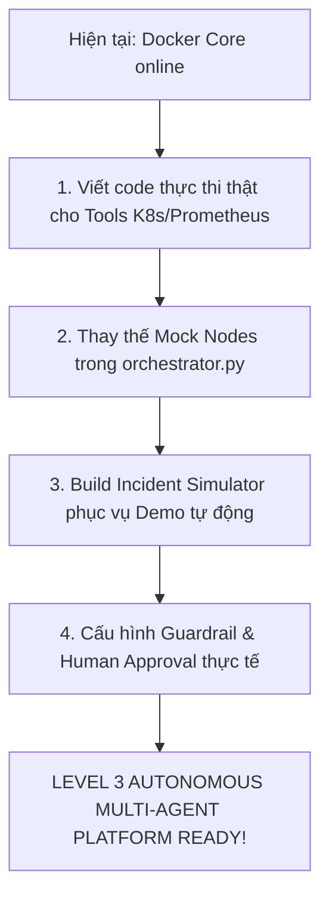

# 🔍 ARCHITECTURAL EVALUATION & ENTERPRISE PRODUCTION ACTION PLAN
> **Đánh giá tính thực tế nghiêm khắc dự án Multi-Agent AIOps & Platform Engineering**

---

## 1. ⚖️ ĐÁNH GIÁ THỰC TẾ TRẠNG THÁI HIỆN TẠI (STATE ASSESSMENT)

Dự án hiện đang ở trạng thái **Khung gầm Hạ tầng vững chắc (Infrastructure Ready)** nhưng **Thiếu logic thực thi thật (Business Logic Gap)**. 

### 🟢 Điểm mạnh (Strengths)
* **Thiết kế Microservices hoàn chỉnh**: Mỗi Agent chạy trong một container biệt lập. Điều này cực kỳ thực tế vì Browser Agent (cần cài Chrome/Playwright) và Computer-Use (cần X11/Xvfb) rất nặng, tách riêng sẽ giúp Gateway và Orchestrator cực kỳ nhẹ và ổn định.
* **Hạ tầng Hybrid LLM tối ưu**: Router trong `shared/llm.py` có khả năng định tuyến thông minh giữa Ollama (DeepSeek-R1 local chạy free) và Claude 3.5 Sonnet (cho các task vision, code phức tạp) giúp tiết kiệm đến 80% chi phí vận hành thực tế.
* **Quy hoạch n8n trực quan**: Đã có sẵn file cấu hình import `docs/n8n_workflow_demo.json` giúp người dùng không bị ngợp khi mới tiếp cận giao diện n8n.

### 🔴 Lỗ hổng cốt lỗ cần giải quyết (Critical Gaps)
Để dự án thực sự chạy được và mang đi demo/sử dụng thực tế, chúng ta phải giải quyết triệt để 5 lỗ hổng lớn sau:

1. **Orchestrator Node bị Mock hoàn toàn**:
   * *Thực trạng*: Trong `apps/gateway/orchestrator.py`, các node xử lý của LangGraph (`_browser_node`, `_computer_use_node`) đang trả về dữ liệu giả lập (hardcoded strings).
   * *Hệ quả*: Khi chạy thật, hệ thống sẽ không có bất kỳ tương tác thực tế nào với trình duyệt hay hệ điều hành.
2. **Thiếu Logic Client kết nối Công cụ thật (K8s & Prometheus)**:
   * *Thực trạng*: Các thư viện kết nối hạ tầng (`kubernetes`, `prometheus-api-client`) chưa được lập trình. Hệ thống mới chỉ dừng ở mức khai báo tên tool trong roadmap.
   * *Hệ quả*: Agent không thể lấy logs thực tế của Pod hay câu lệnh PromQL thật để phân tích.
3. **Chưa hiện thực hóa `guardrail-service`**:
   * *Thực trạng*: Chưa có middleware quét bảo mật lệnh vá lỗi của DevOps Agent gửi đi hay nội dung email của Email Agent soạn thảo.
   * *Hệ quả*: LLM có thể sinh lỗi (Hallucination) viết nhầm lệnh xóa Pod/Namespace của hệ thống và tự động thực thi.
4. **RAG Service mới có khung gầm cơ bản**:
   * *Thực trạng*: Chưa có pipeline tự động quét thư mục `docs/`, thực hiện Semantic Chunking và lưu trữ định danh (Metadata) vào Qdrant Vector DB.

---

## 2. 🚀 KẾ HOẠCH HÀNH ĐỘNG THỰC TẾ ĐỂ "RÕ RÀNG HÓA" DỰ ÁN

Để biến dự án này thành một sản phẩm chạy thực tế 100%, bạn cần triển khai thêm 4 thành phần cụ thể dưới đây:

### BƯỚC 1: Xây dựng "Hộp cát Mô phỏng lỗi" (Incident Simulator Container) 💡
> **ĐÂY LÀ ĐIỂM QUYẾT ĐỊNH TÍNH THỰC TẾ KHI DEMO**
Thay vì yêu cầu khách hàng phải cài đặt cả một cụm Kubernetes Production thật và tự tay làm sập hệ thống (cực kỳ rủi ro), chúng ta sẽ tạo một container mô phỏng sự cố:
* **Tên dịch vụ**: `incident-simulator` (Chạy một Flask/FastAPI app siêu nhẹ).
* **Nhiệm vụ**: Cung cấp các API giả lập lỗi hệ thống:
  * `/trigger/memory-leak`: Tự động ngốn RAM tăng dần đến khi Pod sập.
  * `/trigger/db-connection-failure`: Tự động ngắt kết nối với Postgres database để tạo ra hàng loạt log lỗi `Connection Timeout`.
  * `/trigger/high-latency`: Làm nghẽn hàng đợi xử lý của ứng dụng để Prometheus ghi nhận latency vọt lên >5000ms.
* **Lợi ích**: Khi chạy demo, bạn chỉ cần bấm 1 nút trên Dashboard $\rightarrow$ Lỗi thật được kích hoạt $\rightarrow$ Prometheus Alert bắn sang n8n $\rightarrow$ AI Agent tự động vào cuộc xử lý. Mọi thứ diễn ra tự động 100% và cực kỳ thuyết phục!

### BƯỚC 2: Hiện thực hóa LangGraph Node (`orchestrator.py`)
Thay thế toàn bộ Mock Node bằng HTTP requests gọi sang các container khác thông qua mạng nội bộ Docker:
```python
# Ví dụ cấu trúc gọi HTTP thật trong LangGraph Node
import httpx

async def _browser_node(state: AgentState):
    user_input = state["current_task"]
    async with httpx.AsyncClient() as client:
        # Gọi sang container browser chạy playwright trên cổng 8003
        response = await client.post(
            "http://browser:8003/execute", 
            json={"prompt": user_input},
            timeout=120.0
        )
    result = response.json()
    return {"messages": [AIMessage(content=result["summary"])]}
```

### BƯỚC 3: Viết mã nguồn Python kết nối K8s/Prometheus thật (`tools/`)
* **`k8s-tool`**:
  ```python
  from kubernetes import client, config
  
  def get_pod_logs(pod_name: str, namespace: str = "default"):
      config.load_incluster_config() # Tự động lấy service account khi chạy trong K8s
      v1 = client.CoreV1Api()
      return v1.read_namespaced_pod_log(name=pod_name, namespace=namespace, tail_lines=100)
  ```
* **`prometheus-tool`**:
  ```python
  import requests
  
  def query_prometheus(promql_query: str):
      url = "http://prometheus:9090/api/v1/query"
      response = requests.get(url, params={"query": promql_query})
      return response.json()["data"]["result"]
  ```

### BƯỚC 4: Triển khai Guardrail an toàn tối thiểu (Input/Output Safety)
Viết một class kiểm tra mã độc (Regex + LLM Guardrail) trước khi cho phép DevOps Agent thực thi:
```python
def check_command_safety(command: str) -> bool:
    # Ngăn chặn các câu lệnh hủy diệt hệ thống
    forbidden_keywords = ["rm -rf /", "kubectl delete namespace", "drop database"]
    for keyword in forbidden_keywords:
        if keyword in command.lower():
            return False
    return True
```

---

## 3. 🎯 LỘ TRÌNH TRIỂN KHAI PHẦN THIẾU (NEXT STEPS)



| Tác vụ cần làm thêm | Độ ưu tiên | Ước lượng thời gian | Mục tiêu đạt được |
| :--- | :---: | :---: | :--- |
| **Nối cáp HTTP real cho LangGraph** | 🔥 P0 | 1 ngày | Chạy thông suốt luồng gọi Agent thật qua API Gateway |
| **Lập trình `k8s-tool` & `prometheus-tool`** | 🔥 P0 | 2 ngày | Cho phép Agent tương tác thật với tài nguyên hạ tầng |
| **Xây dựng `incident-simulator` container** | ⚡ P1 | 1.5 ngày | Có môi trường tạo lỗi giả lập để chạy demo tự động |
| **Hoàn thiện `email-agent` & `email-tool`** | ⚡ P1 | 1 ngày | Tự động soạn và gửi email báo cáo sự cố qua SMTP thật |
| **Viết tài liệu tích hợp API Contracts** | ⏳ P2 | 0.5 ngày | Làm rõ cấu trúc JSON payload trao đổi giữa các dịch vụ |
