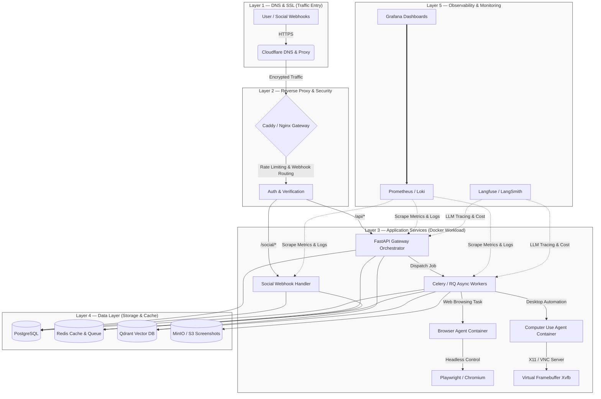

# HƯỚNG DẪN THIẾT KẾ & TRIỂN KHAI HẠ TẦNG AI AGENT PLATFORM (PRODUCTION-GRADE)

Tài liệu này cung cấp bản thiết kế kiến trúc hạ tầng chi tiết, lộ trình cài đặt, và các cấu hình tối ưu để vận hành hệ thống **Personal AI Agent Platform** (tự động điều khiển máy tính, duyệt web, tự động trả lời webhook Facebook/Zalo) đạt tiêu chuẩn production-grade.

---

## 🏗️ 1. Bản Thiết Kế Hệ Thống Tổng Thể (System Architecture)

Để đảm bảo hệ thống có khả năng chịu tải tốt, không bị nghẽn khi chạy các tác vụ nặng (như Browser Automation hay UI Control) và phản hồi webhook mạng xã hội ngay lập tức, hạ tầng được chia làm **5 Layer chuyên biệt**:



---

## 📡 2. Layer 1 & 2 — DNS, SSL & Reverse Proxy

Đối với dự án Multi-Agent kết hợp Webhook Social, **Reverse Proxy** đóng vai trò cực kỳ quan trọng:
1. **Tự động cấp phát/gia hạn SSL** (Zalo OA và Facebook Graph API bắt buộc HTTPS hợp lệ).
2. **Rate Limiting** để bảo vệ hệ thống khỏi các cuộc tấn công spam API/Webhook.
3. **Phân phối tải** và cô lập Gateway xử lý lâu ngày khỏi Webhook có latency cực thấp.

### Cấu hình Khuyên dùng: Caddy Server
Caddy là lựa chọn tốt nhất nhờ cơ chế tự động quản lý chứng chỉ SSL Let's Encrypt / ZeroSSL out-of-the-box và cú pháp cấu hình (`Caddyfile`) vô cùng tinh gọn so với Nginx.

```caddy
# Tên miền của hệ thống AI Agent
api.yourdomain.com {
    # Tự động nén dữ liệu truyền tải
    encode gzip zstd

    # Route cho API Gateway & LangGraph Orchestrator
    handle /api/* {
        reverse_proxy gateway:8000
    }

    # Route chuyên biệt cho Webhook Facebook / Zalo (Social Bot)
    # Tách biệt port giúp webhook phản hồi siêu tốc không bị block bởi task xử lý lớn
    handle /social/* {
        reverse_proxy social:8002
    }

    # Giới hạn số lượng request (Rate Limiting) tránh DDoS
    @api_limit {
        path /api/*
        not remote_ip 127.0.0.1
    }

    # Cấu hình Header Security
    header {
        # Ngăn chặn Clickjacking
        X-Frame-Options "DENY"
        # Bật tính năng XSS Protection trên browser cũ
        X-XSS-Protection "1; mode=block"
        # Hạn chế MIME sniffing
        X-Content-Type-Options "nosniff"
        Strict-Transport-Security "max-age=31536000; includeSubDomains; preload"
    }
}
```

---

## 🐳 3. Layer 3 — Application Workloads (Containerization)

Vì các sub-agent có môi trường runtime cực kỳ phức tạp và xung đột dependencies cao (đặc biệt là Playwright và X11 virtual display), chúng bắt buộc phải chạy trong các **Docker Container** riêng biệt.

### Môi trường Runtime cho Browser Agent (`apps/browser`)
`browser-use` chạy trên nền `Playwright` yêu cầu các thư viện hệ thống của hệ điều hành Linux để mở và tương tác với Chromium.
* **Dockerfile Pattern**: Cần dùng image base `python:3.12-slim` và cài đặt các thư viện C cần thiết cho browser hoặc dùng trực tiếp image chính thức của Playwright `mcr.microsoft.com/playwright/python:v1.45.0-noble`.
* **Resource Limitation**: Môi trường Chromium tiêu thụ rất nhiều RAM (khoảng 300MB - 800MB/tab). Bắt buộc cấu hình `deploy.resources.limits.memory` trong Docker Compose để tránh hiện tượng Out-Of-Memory (OOM) kéo sập cả VPS.

### Môi trường Headless cho Computer Use Agent (`apps/computer_use`)
Để chạy agent điều khiển màn hình máy tính (`pyautogui` hoặc Anthropic Computer Use API) trên môi trường VPS Linux không có màn hình vật lý, bạn cần dựng một **Virtual Desktop**:
1. **Xvfb (X Virtual Framebuffer)**: Tạo một màn hình ảo (Virtual Display) ngay trong bộ nhớ RAM của container.
2. **VNC Server (x11vnc)**: Cho phép kết nối và giám sát hoạt động của agent trực quan bằng công cụ VNC Viewer.
3. **Fluxbox**: Một Window Manager siêu nhẹ để các app UI (như Chrome, VS Code) có thể hiển thị và tương tác một cách có trật tự.

```dockerfile
FROM python:3.12-slim

# Cài đặt môi trường giao diện đồ họa ảo (GUI) và các dependencies
RUN apt-get update && apt-get install -y \
    xvfb \
    x11vnc \
    fluxbox \
    dbus-x11 \
    screencast \
    libx11-dev \
    libxext-dev \
    libxtst-dev \
    libpng-dev \
    python3-tk \
    && apt-get clean \
    && rm -rf /var/lib/apt/lists/*

WORKDIR /app
COPY requirements.txt .
RUN pip install --no-cache-dir -r requirements.txt

# Thiết lập biến môi trường Display ảo cho PyAutoGUI
ENV DISPLAY=:99
ENV RESOLUTION=1280x800x24

# Script khởi tạo Xvfb và chạy FastAPI app
COPY entrypoint.sh /entrypoint.sh
RUN chmod +x /entrypoint.sh

ENTRYPOINT ["/entrypoint.sh"]
```

> File khởi động ảo `entrypoint.sh`:
> ```bash
> #!/bin/bash
> # Khởi động màn hình ảo Xvfb trên Display :99
> Xvfb :99 -screen 0 $RESOLUTION -ac +extension RANDR &
> sleep 2
> 
> # Khởi động window manager fluxbox
> fluxbox &
> sleep 1
> 
> # Khởi động VNC để giám sát từ xa (optional, password: agentpassword)
> x11vnc -forever -shared -bg -rfbport 5900 -nopw -display :99 &
> 
> # Chạy FastAPI app
> exec uvicorn apps.computer_use.main:app --host 0.0.0.0 --port 8004
> ```

---

## 💾 4. Layer 4 — Data Layer (Storage & Cache)

| Tên Service | Vai Trò Trong Hệ Thống | Công Nghệ Lựa Chọn | Lưu Ý Triển Khai (Production) |
| :--- | :--- | :--- | :--- |
| **Relational Database** | Lưu trữ thông tin người dùng, cài đặt của Agent, lịch sử giao dịch, logs thực thi nhiệm vụ của LangGraph. | **PostgreSQL (v16+)** | Cài đặt chỉ mục (Index) trên trường `session_id` và `task_id`. Tích hợp Connection Pooling (`SQLAlchemy QueuePool`) để tránh nghẽn luồng. |
| **Cache & Message Broker** | Làm bộ nhớ tạm thời của Agent (Short-term context), lưu tin nhắn chat gần đây với thời gian sống (TTL = 24h), quản lý hàng đợi tác vụ của Celery. | **Redis (v7-Alpine)** | Bật cơ chế Persistence `appendonly yes` để tránh mất dữ liệu hàng đợi khi container khởi động lại. |
| **Vector Database** | Lưu trữ bộ nhớ dài hạn (Long-term Memory), cơ sở tri thức phục vụ tính năng RAG (Retrieval-Augmented Generation). | **Qdrant (v1.9+)** | Cấu hình Vector kích thước 1536 (nếu dùng `text-embedding-3-small` của OpenAI). Giới hạn RAM tối đa cho Qdrant để tối ưu chi phí tài nguyên VPS. |
| **Object Storage** | Lưu trữ toàn bộ ảnh chụp màn hình (screenshots) trong quá trình Browser & Computer Use vận hành, lưu file xuất ra (CSV, PDF, báo cáo). | **MinIO (Self-hosted)** / **AWS S3** | Thiết lập chính sách tự động xóa ảnh screenshots sau 7 ngày (Lifecycle Rule) để tiết kiệm dung lượng ổ cứng. |

---

## 💬 5. Kiến Trúc Xử Lý Webhook Bất Đồng Bộ (Social Webhook Architecture)

Một lỗi cực kỳ phổ biến của Senior Dev khi làm Social Webhook chatbot (Facebook, Zalo) là **gọi trực tiếp LLM trong luồng xử lý Webhook**. 
* **Vấn đề**: Facebook và Zalo yêu cầu endpoint của bạn phải phản hồi **HTTP 200 OK ngay lập tức (dưới 2 giây)**. Trong khi đó, thời gian sinh câu trả lời của GPT-4o hay Claude 3.5 mất trung bình từ **3 - 10 giây**. Nếu xử lý đồng bộ, webhook sẽ bị timeout, Facebook/Zalo OA sẽ gửi lại tin nhắn đó nhiều lần, gây ra lỗi trả lời lặp lại (double-reply loop).
* **Giải pháp**: Thiết kế kiến trúc **Bất Đồng Bộ (Async Webhook Worker)**.

```
                  ┌───────────────────────────────┐
                  │  Zalo / Facebook Webhook API  │
                  └───────────────┬───────────────┘
                                  │ (User sends a message)
                                  ▼
      ┌───────────────────────────────────────────────────────┐
      │               FastAPI Social Webhook                  │
      │ 1. Verify webhook signature (Security validation)     │
      │ 2. Extract sender_id and message text                 │
      │ 3. PUSH raw message event to Redis Task Queue         │
      │ 4. IMMEDIATE RESPONSE: Return HTTP 200 OK (t < 0.1s)  │
      └───────────────────────────┬───────────────────────────┘
                                  │
                                  │ (Async Queue Processing)
                                  ▼
                     ┌─────────────────────────┐
                     │    Redis Task Queue     │
                     └────────────┬────────────┘
                                  │
                                  ▼
      ┌───────────────────────────────────────────────────────┐
      │                 Celery Async Workers                  │
      │ 1. Pull job from Redis Queue                          │
      │ 2. Load Conversation History from Redis Cache         │
      │ 3. Load Long-term Memory from Qdrant Vector DB        │
      │ 4. Call LLM Router with system prompt (Vietnam tone)  │
      │ 5. Call API (FB Graph / Zalo OA) to send reply message│
      │ 6. Update new conversation turn back to Redis         │
      └───────────────────────────────────────────────────────┘
```

---

## 📊 6. Layer 5 — Observability (Giám Sát Vận Hành)

Hệ thống Multi-Agent rất khó debug nếu không có công cụ tracing trực quan. Bạn cần giám sát 3 yếu tố trọng tâm:

1. **LLM Tracing & Cost Management (Langfuse / LangSmith)**:
   * Giúp visualize luồng rẽ nhánh của LangGraph (Manager Agent đã gọi sub-agent nào, kết quả trả ra là gì).
   * Giám sát chính xác lượng token tiêu thụ, số tiền chi trả cho từng request LLM.
   * Debug nhanh các trường hợp Agent bị lặp vô hạn (Infinite Loop).
2. **System Health Metrics (Prometheus + Grafana)**:
   * Giám sát tài nguyên RAM/CPU của VPS (rất cần thiết vì Browser Agent rất ngốn RAM).
   * Theo dõi độ dài hàng đợi Redis (`queue_length`). Nếu hàng đợi quá dài nghĩa là số lượng Worker xử lý tác vụ không đủ, cần scale-up số container.
3. **Log Aggregation (Grafana Loki)**:
   * Thu thập tập trung toàn bộ logs của các container (gateway, social, browser, database) về một giao diện duy nhất để gõ từ khóa tìm kiếm lỗi thời gian thực.

---

## 🚀 7. Check-list Chuẩn Bị Tài Nguyên Hạ Tầng (Production Ready)

### 🖥️ Khuyến Nghị Cấu Thiết Bị (Hardware Sizing)
* **Môi trường Cá nhân / Thử nghiệm (Local / Dev)**:
  * CPU: 4 Cores (Intel/AMD hoặc Apple Silicon).
  * RAM: 8GB - 16GB.
  * Ổ cứng: 50GB SSD.
* **Môi trường Doanh nghiệp vừa và nhỏ (Production - Low/Mid load)**:
  * VPS: **4 vCPUs - 8GB RAM** (Nếu chạy Browser-use và Computer Use tần suất thấp).
  * SSD: 100GB NVMe.
* **Môi trường Doanh nghiệp lớn (Production - High load)**:
  * VPS riêng cho Data Layer (Postgres + Qdrant + Redis).
  * Khuyên dùng **8 vCPUs - 16GB RAM** cho cụm Application Worker chạy Browser/Computer-Use.

### 🛡️ Danh Sách Security Checklist bắt buộc trước khi Go-Live
- [ ] **Thay đổi API Secret Keys**: Không bao giờ sử dụng JWT keys, database passwords mặc định trong `.env.example`.
- [ ] **Bật SSH Key Authentication**: Tắt hoàn toàn việc đăng nhập VPS bằng mật khẩu truyền thống.
- [ ] **Cấu hình Firewall (UFW)**: Chỉ mở các port public cần thiết (`80`, `443` cho Caddy). Đóng toàn bộ các port DB (`5432`), Redis (`6379`), Qdrant (`6333`) với bên ngoài, chỉ cho phép các container trong cùng mạng Docker kết nối chéo với nhau.
- [ ] **Xác thực Webhook Signature**: Trong file `facebook.py` và `zalo.py`, bắt buộc triển khai hàm kiểm tra chữ ký (`SHA-256 HMAC`) đi kèm trong header của webhook gửi từ máy chủ Facebook/Zalo để chống giả mạo request tấn công API.
- [ ] **Đặt Ngưỡng Hạn Mức Chi Phí LLM (Budget Alerts)**: Cài đặt hạn mức thanh toán hàng tháng trên tài khoản OpenAI/Anthropic của bạn để tránh tình trạng Agent bị lỗi lặp vô hạn (infinite token generation loop) tiêu hết sạch tiền trong thẻ tín dụng của bạn.

---

*Tài liệu này được biên soạn độc quyền phục vụ dự án **AI Agent Automation Platform**.*
